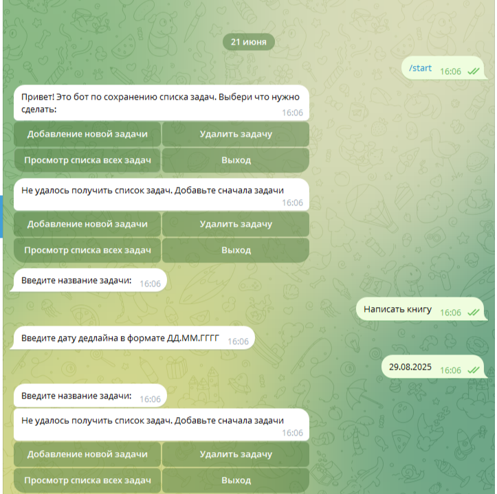

## Разработать  телеграмм бота на базе aiogram3, 
который взаимодействует с сервером, созданным с использованием FastAPI. 
Сервер предоставляет API для управления поведением бота.

### Функциональные требования:
Telegram-бот:

#### Меню команд:
/start  - приветственное сообщение и инструкции по работе с ботом
/show_tasks - показывает список задач, полученных от API
/add_task - позволяет пользователю добавить новую задачу (с использованием машины состояний)
/delete_task - позволят удалить задачу по ее ID

#### Машина состояний: 
Реализуйте машину состояний для команды \add_task.

#### Пользователь вводит:
- название задачи
- дедлайн задачи в формате ДД.ММ.ГГГГ
- после успешного ввода данных бот отправляет запрос к серверу. чтобы сохранить задачу

#### Клавиатуры:
Реализовать инлайн-кнопки для удаления задач в команде /delete_task
Каждая кнопка отображает ID задачи и вызывает обработчик удаления.

#### FastAPI сервер:
Эндпоинты:

GET /tasks — Возвращает список всех задач.
POST /tasks — Добавляет новую задачу.
Тело запроса:
json
{
  "name": "Название задачи",
  "deadline": "ДД.ММ.ГГГГ"
}
DELETE /tasks/{task_id} — Удаляет задачу по ID.

#### Хранилище: 
Реализуйте базу данных SQLite с таблицей tasks для хранения задач.

### Пример:
Пользователь вводит /add_task.
Бот: "Введите название задачи."

Пользователь: "Сделать отчет."
Бот: "Введите дедлайн (ДД.ММ.ГГГГ)."
Пользователь: "25.11.2024"
Бот отправляет запрос на сервер и подтверждает добавление.

При выполнении /show_tasks бот получает список задач от API:
1. Сделать отчет (дедлайн: 25.11.2024)
2. Купить продукты (дедлайн: 20.11.2024)

При выполнении /delete_task бот выводит инлайн-кнопки:
[Удалить 1] [Удалить 2]

# ОТЧЕТ
Так и не удалось мне разобраться почему API не соединяется с базой данных, 
напрямую соединение проходит, но вот с АПИ никак не хочет.
Из-за сильно ограниченого количества времени отправляю то что получается.

Я понимаю логику работы хэндлеров и АПИ так:
от пользователя по инлайн кнопкам приходит calback_query, затем он передает запрос в АПИ, 
который в свою очередь выполняет необходимую функцию. Если это запрос получения информации из базы данных,
берем get, если нам нужно что-то добавить в базу данных, используем post.

Поскольку не соединяется с базой данных то и не получается проверить работы остальных функций.
Возможно есть другие способы, но я о них не знаю. 
Понимаю, что требуется еще много изучить, мне не хватило 10 месяцев. Я еще новичок в программировании.

